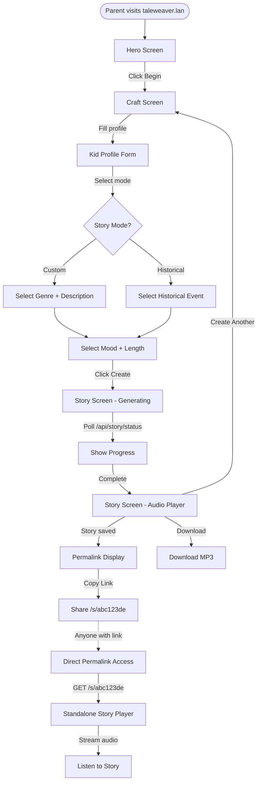
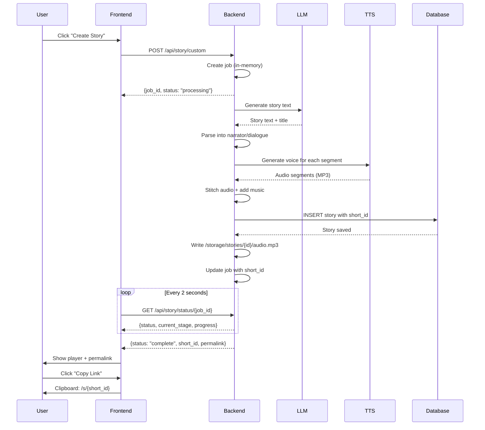

# Taleweaver - End-to-End User Experience Flow

## Overview

Taleweaver guides parents through a 3-screen immersive journey to create personalized audio stories for their kids. Stories are permanently saved with shareable permalink URLs.

---

## UX Flow Diagram



---

## Screen-by-Screen Flow

### 1. Hero Screen
**URL:** `/` (any path on initial load)  
**Route:** Frontend SPA root

**User sees:**
- Dark fantasy themed landing page
- Floating particle effects
- App title: "Taleweaver"
- Tagline: "Personalized audio stories for kids, powered by AI"
- Single CTA button: "Begin"

**User actions:**
- Click "Begin" → Navigate to Craft Screen

**Technical:**
- Frontend route: `/` (hero step in React state)
- No API calls
- Purely presentational

---

### 2. Craft Screen
**URL:** `/` (craft step in state)  
**Route:** Frontend SPA (state-based navigation)

**User sees:**
1. **Kid Profile Form:**
   - Name (required)
   - Age (required, 3-12)
   - Optional fields: favorite animal, color, hobby, best friend, pet name, personality

2. **Story Type Selection:**
   - "Custom Story" (kid is the hero)
   - "Historical Adventure" (kid is time-traveling observer)

3. **Genre/Event Selection:**
   - If Custom: 7 genres (adventure, fantasy, space, bedtime, funny, underwater, magical-forest)
   - If Historical: 20 curated events (including Indian history)

4. **Story Customization:**
   - Mood: exciting, heartwarming, funny, mysterious
   - Length: short (~200-500 words), medium (~400-700), long (~700-1000)

5. **Description** (Custom only): Free-text story idea

**User actions:**
- Fill in kid profile
- Select story type
- Choose genre/event
- Select mood and length
- Click "Create Story" → Navigate to Story Screen (generation starts)

**API Calls:**
- `GET /api/genres` - Fetch available genres (on mount)
- `GET /api/historical-events` - Fetch historical events (on mount)
- `POST /api/story/custom` - Create custom story job
  - Request body: `{kid: {...}, genre: "fantasy", description: "...", mood: "exciting", length: "medium"}`
  - Response: `{job_id: "uuid", status: "processing", stages: [...], current_stage: "writing"}`
- `POST /api/story/historical` - Create historical story job
  - Request body: `{kid: {...}, event_id: "event-id", mood: "heartwarming", length: "short"}`
  - Response: `{job_id: "uuid", status: "processing", ...}`

**Technical:**
- Frontend manages form state
- Validates age (3-12)
- Session storage for persistence across refreshes

---

### 3. Story Screen - Generation Phase
**URL:** `/` (story step in state, isGenerating=true)  
**Route:** Frontend SPA

**User sees:**
- Color-cycling pulsing orb animation
- Stage label updates every 5-20 seconds:
  - "Writing the story..."
  - "Preparing character voices..."
  - "Generating audio..."
  - "Mixing the final track..."
- Subtitle: "This usually takes about a minute"

**User actions:**
- Wait (no interaction)
- Can refresh page - generation continues (polls by job_id from session storage)

**API Calls:**
- `GET /api/story/status/{job_id}` - Poll every 2 seconds
  - While processing: `{job_id, status: "processing", current_stage: "synthesizing", progress: 5, total_segments: 12}`
  - On completion: `{job_id, status: "complete", title: "...", duration_seconds: 180, audio_url: "/api/story/audio/{job_id}", transcript: "...", short_id: "abc123de", permalink: "/s/abc123de"}`
  - On error: `{job_id, status: "failed", error: "..."}`

**Backend Pipeline:**
```
POST /api/story/custom
  ↓
1. Create job (in-memory) → Return job_id
2. Start async pipeline:
   - Story Writer (LLM generates story text)
   - Script Splitter (parses narrator/character dialogue)
   - Voice Synthesizer (ElevenLabs TTS for each segment)
   - Audio Stitcher (concatenate + add background music)
3. Save to database (SQLite) → Generate short_id
4. Write audio file to /storage/stories/{job_id}/audio.mp3
5. Update job status to "complete" with short_id
```

**Database Write:**
```sql
INSERT INTO stories (
  id, short_id, title, kid_name, kid_age,
  story_type, genre, mood, length,
  transcript, duration_seconds, audio_path, created_at
) VALUES (...)
```

**Typical timing:**
- Short story: 20-40 seconds
- Medium story: 45-75 seconds  
- Long story: 60-120 seconds

---

### 4. Story Screen - Playback Phase
**URL:** `/` (story step in state, isGenerating=false)  
**Route:** Frontend SPA

**User sees:**
1. **Story Title** (large, centered)
2. **Waveform Visualization** (animated while playing)
3. **Progress Bar** with current time / total duration
4. **Play/Pause Button** (large, center)
5. **Action Buttons:**
   - "Download MP3"
   - "Create Another Story"
6. **Permalink Share Section:** (NEW! ✨)
   - Label: "Share this story:"
   - Read-only input: `http://taleweaver.lan/s/abc123de`
   - "Copy Link" button (changes to "Copied!" for 2 seconds)
7. **Transcript Toggle:** "Read the Story" (expandable)

**User actions:**
- Click Play/Pause → Control audio playback
- Drag progress bar → Seek to specific time
- Click Download → Download `{title}.mp3`
- Click Copy Link → Copy permalink to clipboard (shows "Copied!" feedback)
- Click Create Another → Return to Craft Screen
- Click "Read the Story" → Expand transcript

**API Calls:**
- `GET /api/story/audio/{job_id}` - Stream audio (temporary, expires after 1 hour)
  - Returns: MP3 audio bytes with headers:
    - `Content-Type: audio/mpeg`
    - `Content-Disposition: inline; filename="story-{job_id}.mp3"`
    - `Accept-Ranges: bytes`

**Permalink Info:**
- Format: `/s/{short_id}` (8 characters, a-z0-9)
- Example: `/s/a7x9k2mn`
- Permanent (never expires)
- Shareable to anyone
- No authentication required

**Technical:**
- Audio element with HTML5 playback
- Real-time progress tracking
- Clipboard API for copy functionality
- Session storage for state persistence

---

### 5. Permalink Access (Standalone)
**URL:** `/s/{short_id}` (e.g., `/s/a7x9k2mn`)  
**Route:** Backend API endpoint

**User journey:**
- Parent shares link via text, email, QR code, etc.
- Recipient clicks link
- Currently: Gets JSON metadata (future: could render standalone player)

**API Response:**
```json
{
  "id": "uuid",
  "short_id": "a7x9k2mn",
  "title": "The Magical Adventure of Arjun",
  "kid_name": "Arjun",
  "kid_age": 7,
  "story_type": "custom",
  "genre": "fantasy",
  "transcript": "Once upon a time...",
  "duration_seconds": 180,
  "created_at": "2026-03-21T10:30:00",
  "permalink": "/s/a7x9k2mn",
  "audio_url": "/s/a7x9k2mn/audio"
}
```

**Audio Streaming:**
- `GET /s/{short_id}/audio` - Stream audio file
  - Reads from `/storage/stories/{uuid}/audio.mp3`
  - Returns MP3 with proper headers
  - Supports range requests for seeking

**Future Enhancement:**
Could render a standalone player page at `/s/{short_id}` instead of JSON, allowing anyone with the link to listen directly in their browser.

---

## Complete URL Routing Map

### Frontend Routes (React SPA)

| Path | Screen | State | Notes |
|------|--------|-------|-------|
| `/` | Hero → Craft → Story | Managed by React state | All frontend routes go to index.html |
| Any unknown path | Hero (initial) | - | SPA handles routing |

### Backend API Routes

#### Story Generation (Temporary, 1-hour TTL)

| Method | Path | Purpose | Response |
|--------|------|---------|----------|
| POST | `/api/story/custom` | Create custom story job | `{job_id, status, stages}` |
| POST | `/api/story/historical` | Create historical story job | `{job_id, status, stages}` |
| GET | `/api/story/status/{job_id}` | Poll job progress | Status or complete response with **short_id + permalink** |
| GET | `/api/story/audio/{job_id}` | Stream audio (temporary) | MP3 audio bytes |

#### Permalinks (Permanent)

| Method | Path | Purpose | Response |
|--------|------|---------|----------|
| GET | `/s/{short_id}` | Get story metadata | JSON with story details |
| GET | `/s/{short_id}/audio` | Stream audio (permanent) | MP3 audio bytes |

#### Configuration

| Method | Path | Purpose | Response |
|--------|------|---------|----------|
| GET | `/api/health` | Health check | `{status: "ok"}` |
| GET | `/up` | Once health check | `{status: "ok"}` |
| GET | `/api/status` | App configuration status | `{configured, llm_configured, tts_configured, ready}` |
| GET | `/api/genres` | List story genres | Array of genre objects |
| GET | `/api/historical-events` | List historical events | Array of event objects |

---

## State Management & Persistence

### In-Memory (During Generation)

**Jobs Dictionary:**
```python
jobs[job_id] = {
    "status": "processing|complete|failed",
    "current_stage": "writing|splitting|synthesizing|stitching|done",
    "title": "Story Title",
    "duration_seconds": 180,
    "final_audio": b"mp3 bytes",
    "transcript": "Full story text",
    "short_id": "abc123de",  # NEW! Set after DB save
    "progress": 5,
    "total_segments": 12,
    "error": "",
}
```

Jobs expire after 1 hour (JOB_TTL_SECONDS = 3600)

### Database (Permanent)

**SQLite at `/storage/taleweaver.db`:**
```sql
stories (
  id, short_id, title, kid_name, kid_age,
  story_type, genre, event_id, mood, length,
  transcript, duration_seconds, audio_path, created_at
)
```

**File Storage:**
```
/storage/stories/{uuid}/audio.mp3
```

Stories are permanent and never expire.

### Frontend Session Storage

```javascript
{
  step: "hero|craft|story",
  jobId: "uuid",
  kidProfile: {...},
  storyType: "custom|historical",
  mood: "exciting|heartwarming|funny|mysterious",
  length: "short|medium|long",
  isGenerating: boolean,
  currentStage: "writing|...",
  storyTitle: "...",
  storyDuration: 180,
  audioUrl: "/api/story/audio/{job_id}",
  transcript: "..."
}
```

Persists across page refreshes during generation.

---

## User Experience Timeline

### Typical Flow (Custom Story)

```
0:00  - Land on Hero Screen
0:05  - Click "Begin" → Craft Screen
0:10  - Fill kid profile (name: Arjun, age: 7)
0:20  - Select "Custom Story"
0:25  - Choose genre: "Fantasy"
0:30  - Enter description: "A magical adventure in an enchanted forest"
0:35  - Select mood: "Exciting", length: "Medium"
0:40  - Click "Create Story"
0:41  - Story Screen appears (generating animation)
0:41  - Backend: POST /api/story/custom → job_id
0:42  - Frontend: Start polling GET /api/story/status/{job_id}
0:45  - Stage: "Writing the story..."
1:05  - Stage: "Preparing character voices..."
1:15  - Stage: "Generating audio..." (progress: 3/8 segments)
1:35  - Stage: "Mixing the final track..."
1:45  - Pipeline complete! Story saved to database
1:45  - Response includes: short_id="a7x9k2mn", permalink="/s/a7x9k2mn"
1:46  - Audio player appears
1:46  - Permalink displayed: http://taleweaver.lan/s/a7x9k2mn
1:50  - Parent clicks "Copy Link" → "Copied!" feedback
1:55  - Parent shares link with grandparents
2:00  - Parent clicks Play → Story plays
5:00  - Story ends, parent clicks "Create Another Story"
```

### Permalink Sharing Flow

```
Parent creates story → Gets permalink → Shares link
                                           ↓
                    Grandparent clicks /s/a7x9k2mn
                                           ↓
                    Currently: JSON metadata response
                    Future: Standalone player page
                                           ↓
                    Access audio at /s/a7x9k2mn/audio
```

---

## API Request/Response Flow

### Custom Story Creation



---

## Permalink Architecture

### Short ID Generation

```python
# Generate 8-character ID from a-z0-9 (36 chars)
alphabet = "abcdefghijklmnopqrstuvwxyz0123456789"
short_id = random_8_chars(alphabet)

# Collision check
while db.query(Story).filter(short_id == short_id).first():
    short_id = random_8_chars(alphabet)
```

**Uniqueness:**
- 36^8 = 2.8 trillion possible IDs
- Collision probability < 0.001% for first 10 million stories
- Case-insensitive (easy to share verbally)

### Permalink URLs

**Format:** `/s/{short_id}`

**Examples:**
- `/s/a7x9k2mn`
- `/s/3kp8qr5t`
- `/s/xy9z4abc`

**Properties:**
- ✅ Permanent (never expires)
- ✅ Short and memorable
- ✅ Easy to share (text, email, QR code)
- ✅ No authentication required
- ✅ Works on any device

### Storage Structure

```
/storage/
├── taleweaver.db              # SQLite database
│   └── stories table          # Metadata + short_id mapping
└── stories/
    ├── e9816dca-3e15.../       # Story UUID (job_id)
    │   └── audio.mp3           # 2.5 MB MP3 file
    ├── a4b2c8d1-9f23.../
    │   └── audio.mp3
    └── ...
```

**Database record:**
```json
{
  "id": "e9816dca-3e15-45ea-82b0-3b623f1cf88a",
  "short_id": "a7x9k2mn",
  "title": "Augusta Rose and the Mountain That Grew",
  "kid_name": "Augusta Rose",
  "kid_age": 5,
  "story_type": "historical",
  "event_id": "first-ascent-everest",
  "mood": "exciting",
  "length": "medium",
  "transcript": "Once upon a time...",
  "duration_seconds": 225,
  "audio_path": "/storage/stories/e9816dca.../audio.mp3",
  "created_at": "2026-03-21T18:17:31"
}
```

---

## Screen Components

### Hero Screen
- **ParticleBackground** - Animated floating particles
- **Title** - "Taleweaver" with glow effect
- **CTA Button** - "Begin" with hover effects

### Craft Screen
- **KidProfileForm** - Name, age, optional details
- **StoryTypeToggle** - Custom vs Historical
- **GenreGrid** - 7 genre cards with icons (Custom mode)
- **EventList** - 20 historical events with thumbnails (Historical mode)
- **MoodSelector** - 4 mood options with icons
- **LengthSelector** - Short/Medium/Long toggle
- **DescriptionTextarea** - Free-text input (Custom mode)
- **CreateButton** - "Create Story" with glow effect

### Story Screen (Generation)
- **PulsingOrb** - Color-cycling animation
- **StageLabel** - Current pipeline stage
- **ProgressIndicator** - Subtle animation

### Story Screen (Playback)
- **AudioPlayer**
  - Waveform visualization
  - Progress bar (interactive)
  - Current time / Total duration
  - Play/Pause button
- **ActionButtons**
  - Download MP3
  - Create Another Story
- **PermalinkSection** ✨ NEW
  - Shareable URL display
  - Copy button with feedback
- **TranscriptSection**
  - Expandable story text
  - Toggle button

---

## Data Flow Summary

### Story Creation Flow

```
User Input → API Request → Job Created (in-memory)
                              ↓
                    Async Pipeline Starts
                              ↓
            LLM → Parse → TTS → Stitch → Save
                                          ↓
                              ┌──────────┴──────────┐
                              ↓                     ↓
                      Save to Database        Write Audio File
                      (with short_id)         (/storage/stories/)
                              ↓
                      Update Job (in-memory)
                      job["short_id"] = "abc123"
                              ↓
                      Frontend Polls Status
                              ↓
                      Receives: {short_id, permalink}
                              ↓
                      Display Permalink UI
```

### Permalink Access Flow

```
User clicks /s/a7x9k2mn
        ↓
Backend: GET /s/{short_id}
        ↓
Query Database: SELECT * FROM stories WHERE short_id = 'a7x9k2mn'
        ↓
Return: Story metadata JSON
        ↓
OR
        ↓
User requests /s/a7x9k2mn/audio
        ↓
Backend: GET /s/{short_id}/audio
        ↓
Query Database: Get audio_path
        ↓
Read File: /storage/stories/{uuid}/audio.mp3
        ↓
Stream: MP3 bytes to client
```

---

## Error Handling

### Generation Errors

**LLM Errors:**
- Rate limit → "API rate limit reached. Please wait a moment and try again."
- Invalid API key → "LLM provider error. Please check your API key and try again."
- Timeout → "The request timed out. Please try again."

**TTS Errors:**
- Quota exceeded → "ElevenLabs voice generation quota exceeded. Please upgrade your plan or wait for it to reset."
- Invalid key → "Invalid ElevenLabs API key. Please check your key."
- 401 → "ElevenLabs authentication failed. Please check your API key or quota."

**Database Errors:**
- Save failure → Logged, but job still completes (audio still available via job_id)
- User gets story, just no permalink

### Permalink Errors

**Story Not Found:**
```json
GET /s/invalid123
→ 404 {"detail": "Story not found"}
```

**Audio File Missing:**
```json
GET /s/valid123/audio
→ 404 {"detail": "Audio file not found"}
```

---

## Future UX Enhancements

### Standalone Permalink Player

Instead of JSON at `/s/{short_id}`, render a minimal player page:

```
┌─────────────────────────────────────┐
│  🎭 Taleweaver                      │
├─────────────────────────────────────┤
│                                     │
│   The Magical Adventure of Arjun    │
│                                     │
│   ▶️  [========>-------] 2:15 / 3:00│
│                                     │
│   📥 Download MP3                   │
│                                     │
│   Created for Arjun, age 7          │
│   March 21, 2026                    │
│                                     │
│   🔗 Share this story               │
│   [http://taleweaver.lan/s/a7x9...]│
│                                     │
└─────────────────────────────────────┘
```

### Story Library

- List all stories for a given kid name
- Search by date, genre, mood
- Organize into collections

### Social Sharing

- QR code generation for easy mobile sharing
- "Share via..." buttons (WhatsApp, Email, etc.)
- Embed player on external sites

---

## Technical Architecture

### Request Flow Through Stack

```
Browser Request
    ↓
Caddy (port 80) - Reverse Proxy
    ↓
    ├─ /up → FastAPI (health check)
    ├─ /api/* → FastAPI (API routes)
    ├─ /s/* → FastAPI (permalink routes) ✨ NEW
    └─ /* → Frontend static files (SPA)
          ↓
    FastAPI (port 8000)
          ↓
    ├─ Routes → Controllers
    ├─ LangGraph Pipeline
    ├─ Database (SQLAlchemy)
    └─ File Storage
```

### Data Persistence

**Temporary (In-Memory):**
- Active jobs during generation
- Expire after 1 hour
- Lost on server restart

**Permanent (Database + Files):**
- Story metadata in SQLite
- Audio files in `/storage/stories/`
- Permalinks never expire
- Survive server restarts

---

## Performance Characteristics

### Story Generation Time

| Length | Words | Audio Duration | Generation Time |
|--------|-------|----------------|-----------------|
| Short  | 200-500 | 30-90s | 20-45s |
| Medium | 400-700 | 90-180s | 45-75s |
| Long   | 700-1000 | 180-300s | 60-120s |

**Factors affecting generation time:**
- LLM provider speed (Groq fastest, Claude slower but better quality)
- Story length (more segments = more TTS calls)
- ElevenLabs API response time
- Background music mixing

### Storage Requirements

**Per Story:**
- Database record: ~2 KB
- Audio file: 1.5-4 MB (depending on length)

**Example:**
- 100 stories = 200 KB DB + ~250 MB audio
- 1,000 stories = 2 MB DB + ~2.5 GB audio

---

## Accessibility & Mobile

### Current Support

- ✅ Responsive design (works on mobile)
- ✅ Touch-friendly buttons
- ✅ Readable on small screens
- ✅ Copy permalink works on mobile
- ✅ Audio playback on iOS/Android

### Browser Compatibility

- Chrome/Edge: ✅ Full support
- Firefox: ✅ Full support  
- Safari: ✅ Full support (including iOS)
- Mobile browsers: ✅ Tested

---

## Security & Privacy

### No Authentication

- ✅ **Simple:** No login required
- ✅ **Privacy:** No user accounts or tracking
- ⚠️ **Trade-off:** Anyone with permalink can access story

### Data Storage

- Stories stored locally on your server
- No external storage or cloud sync
- Parent controls the server = parent controls the data

### API Keys

- Stored in environment variables
- Never exposed to frontend
- Backup using `./scripts/backup-once-env.sh`

---

## Summary

Taleweaver provides a **3-screen immersive experience** for creating personalized audio stories:

1. **Hero** → Welcome and call to action
2. **Craft** → Personalize and configure story  
3. **Story** → Generate and share

**Key innovation:** Stories are permanently saved with **compact, shareable permalinks** (`/s/{short_id}`), making it easy to build a family library and share with loved ones.

**URLs:**
- Generation: `/` (SPA state-based navigation)
- Permalinks: `/s/{short_id}` (permanent, shareable)
- API: `/api/*` (backend services)

**Total user time:** ~2-3 minutes from landing to listening! 🎉
